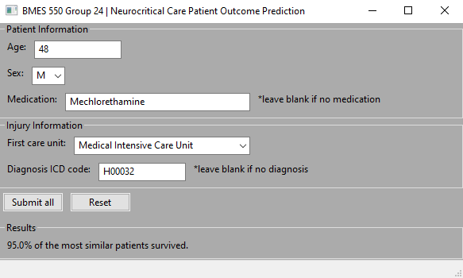

# Neurocritical Care Patient Outcome Prediction GUI

Authors: Zack Goldblum, Josh Miller, Kevin Ramirez Chavez

This project provides a GUI interface for clinicians to predict the outcome of a neurocritical care patient. The parameters input for a current patient are compared to a database of retrospectively collected patients and medical data using a k nearest neighbors algorithm. The utilized database is the [Medical Information Mart for Intensive Care (MIMIC)-IV](https://physionet.org/content/mimiciv/2.1/). 

Reference: Johnson, A., Bulgarelli, L., Pollard, T., Horng, S., Celi, L. A., & Mark, R. (2022). MIMIC-IV (version 2.1). PhysioNet. https://doi.org/10.13026/rrgf-xw32.

## Installation

Install the necessary packages:

    pip install wxPython

    pip install ipykernel

    pip install notebook

    pip install pandas

    pip install numpy
    
This project was created using Python version 3.10.8.

## How to use

1 - Download all files into a directory on your computer. 
	
2 - Open create_mimic_iv_sql.ipynb.

3 - Execute the first code cell in the notebook.

4 - Extract the following MIMIC-IV datasets to C:/Users/USERNAME/AppData/Local/Temp/bmes/final_project_csv.

    hosp/admissions.csv
    
    hosp/d_icd_diagnoses.csv

    hosp/diagnoses_icd.csv

    hosp/patients.csv
    
    hosp/pharmacy.csv
    
    icu/icustays.csv
	
5 - Run the rest of the notebook.

6 - Run gui.py:

    python gui.py

7 - Enter the patient information and click "Submit all". The predicted patient outcome results are displayed at the bottom of the GUI.

